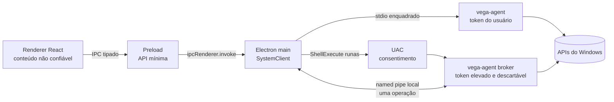

# ADR 0001 — Broker privilegiado descartável no Windows

- **Status:** aceita para implementação
- **Data:** 2026-07-13
- **Issue:** [#49](https://github.com/britors/Vega/issues/49)
- **Escopo:** Windows 11 x64 Home e Pro

## Contexto

No Linux, o Electron roda como usuário comum e o `vegad` é ativado pelo
systemd no barramento de sistema. O D-Bus identifica o remetente e cada
mutação chama uma action polkit granular. Esse caminho é a baseline do
produto e não será substituído nem adaptado para atender ao Windows.

No Windows não existe uma equivalência direta para D-Bus + polkit. Um serviço
persistente elevado não exibe consentimento UAC por operação e aumenta o
tempo e a superfície em que código privilegiado fica disponível. Ele também
exige um protocolo capaz de atender várias sessões de usuário com segurança.

A UI Electron não é uma fronteira de segurança: conteúdo comprometido no
renderer pode invocar tudo que o preload expõe. Por isso, validação e
autorização precisam existir novamente no processo principal e, para ações
elevadas, no próprio broker.

## Decisão

O primeiro backend Windows usará um executável nativo Go, instalado e
assinado, com dois modos:

1. **agente de usuário:** filho não elevado do processo principal Electron;
   atende consultas e mutações que cabem no token do usuário;
2. **broker elevado descartável:** uma nova instância iniciada com o verbo
   `runas` para exatamente uma operação administrativa e encerrada ao
   concluí-la.

Não haverá Windows Service persistente no primeiro release. Essa decisão só
poderá ser revista por outra ADR caso apareça uma necessidade que não possa
ser atendida por uma operação interativa e limitada no tempo.

O Electron inteiro nunca será elevado. O renderer nunca falará diretamente
com Win32, PowerShell, o agente ou o broker.

## Processos e fronteiras de confiança



As fronteiras são:

- **renderer → preload:** todo valor é não confiável; o preload expõe apenas
  métodos enumerados;
- **preload → main:** o processo principal valida tipo, tamanho e formato
  antes de selecionar uma operação do `SystemClient`;
- **main → agente:** não há ganho de privilégio, mas o agente repete todas as
  validações antes de acessar o sistema;
- **main → broker:** é a fronteira de elevação. O UAC autoriza a execução do
  broker, enquanto seu ciclo descartável o limita à única operação mostrada
  previamente na confirmação do Vega;
- **broker → sistema:** somente adaptadores nativos e comandos internos
  constantes podem alcançar APIs privilegiadas.

## Ciclo de vida

### Agente de usuário

- é iniciado sob demanda pelo `SystemClient` com o mesmo token e sessão do
  Electron;
- comunica-se exclusivamente pelos handles de `stdin`/`stdout` herdados;
- encerra quando o Electron fecha, o pipe de stdio quebra ou fica ocioso pelo
  timeout configurado;
- é colocado em um Job Object com `KILL_ON_JOB_CLOSE` para não ficar órfão;
- nunca tenta elevar o próprio token.

### Broker elevado

1. O main valida a requisição e mostra uma confirmação com operação, alvo e
   impacto.
2. O main cria uma instância única de named pipe com nome aleatório e DACL
   explícita.
3. O main inicia o executável assinado com `ShellExecuteEx(..., "runas", ...)`.
4. Após o UAC, o broker conecta ao pipe, e os dois lados verificam a identidade
   do processo remoto.
5. O broker gera um nonce, negocia a versão e aceita uma única requisição
   vinculada àquele nonce.
6. O broker valida novamente a operação e os argumentos, executa, emite
   progresso/resultado, registra a auditoria e encerra.
7. O main fecha o pipe em sucesso, erro, cancelamento, timeout ou encerramento
   da sessão.

Não existe reutilização do broker entre operações, cache de consentimento ou
modo residente em background.

## Transporte do agente de usuário

O agente de usuário usa stdio anônimo porque os handles já vinculam o filho ao
processo que o iniciou e não criam um endpoint local descobrível. O protocolo
usa o mesmo envelope do broker para que DTOs, validações e testes possam ser
compartilhados.

- frames binários: `uint32` little-endian com o tamanho, seguido de JSON UTF-8;
- versão inicial: `1`;
- tamanho máximo por frame: 1 MiB;
- JSON com campos desconhecidos ou duplicados é rejeitado;
- somente uma mensagem completa pode ocupar um frame;
- progresso respeita backpressure; nunca cresce em fila sem limite.

## Named pipe do broker

O pipe seguirá estas regras cumulativas:

- nome `\\.\pipe\Vega\<session-id>\<128-bits-aleatorios>`;
- `FILE_FLAG_FIRST_PIPE_INSTANCE` para impedir precriação do mesmo endpoint;
- `PIPE_REJECT_REMOTE_CLIENTS` e negação explícita a `NT AUTHORITY\NETWORK`;
- uma única instância, duplex, assíncrona e em modo byte;
- security descriptor criado explicitamente; nunca usar a DACL padrão;
- DACL mínima para `SYSTEM`, administradores e o logon SID da sessão
  solicitante; sem `Everyone`, `Anonymous` ou usuários autenticados em geral;
- permissões expressas com direitos mínimos, evitando `GENERIC_WRITE` quando
  ele conceder implicitamente criação de instância;
- todos os handles não necessários são marcados como não herdáveis.

A DACL limita contas e sessões, mas não distingue dois processos do mesmo
usuário. Portanto ela não substitui a autenticação de processo.

### Autenticação mútua

Depois da conexão:

- o main obtém o PID do cliente com `GetNamedPipeClientProcessId`;
- o broker obtém o PID do servidor com `GetNamedPipeServerProcessId`;
- ambos abrem o processo remoto com o menor direito de consulta possível;
- caminho canônico, produto, versão e assinatura Authenticode são validados;
- os executáveis devem estar sob o diretório de instalação protegido em
  `Program Files`; instalação por usuário não habilita operações elevadas;
- o main confirma que o cliente possui token elevado;
- o broker confirma que o servidor pertence à sessão interativa esperada;
- qualquer falha fecha o pipe antes de ler parâmetros da operação.

Builds de desenvolvimento sem assinatura não habilitam o broker. Testes de
integração privilegiados usam binários de teste assinados ou um adaptador
fake sem acesso ao sistema.

## Protocolo privilegiado v1

O handshake produz um `brokerNonce` aleatório de 256 bits. A requisição é
aceita somente se refletir esse nonce e se for o primeiro request ID daquela
instância.

Exemplo ilustrativo; não é um contrato para aceitar campos livres:

```json
{
  "version": 1,
  "kind": "request",
  "requestId": "018f4c7a-7e4e-7b2a-9f55-65c7c949b011",
  "brokerNonce": "base64url-256-bits",
  "operation": "service.setRunning",
  "params": {
    "serviceName": "Spooler",
    "running": true
  }
}
```

As mensagens possíveis são `hello`, `request`, `progress`, `result`,
`cancel` e `error`. Cada mensagem possui schema fechado e validação de
comprimento, enum, faixa numérica, caminho e identificador.

Regras adicionais:

- uma instância aceita no máximo uma `request` e um resultado terminal;
- request IDs usam UUIDv7 e não são reaproveitados;
- o nonce existe apenas em memória e é apagado no encerramento;
- o timeout para conexão/UAC é 90 segundos;
- após conexão, o idle timeout é 30 segundos;
- cada operação define um timeout absoluto, nunca superior a 30 minutos;
- cancelamento fecha novas etapas e encerra subprocessos pelo Job Object;
- cancelamento não promete rollback de uma alteração já confirmada pelo SO;
- frames inválidos, excedentes ou fora de ordem encerram a conexão.

## Catálogo de operações

O protocolo não terá `exec`, `shell`, `powershell`, `script`, `run` genérico
ou qualquer equivalente. Toda operação é uma constante compilada nos dois
lados e possui DTO próprio.

O broker pode usar uma API Win32/COM ou iniciar um executável conhecido com
argumentos separados e validados. É proibido concatenar argumentos em uma
linha de shell, usar `cmd.exe /c` ou interpolar entrada do cliente em
`PowerShell -Command`.

Novas operações privilegiadas exigem, no mesmo PR:

1. enum e DTO versionados;
2. validação no main e no broker;
3. confirmação de impacto na UI;
4. redação de auditoria;
5. teste de autorização, entradas-limite e falha;
6. atualização da matriz abaixo.

## Classificação inicial de privilégios

| Domínio | Contexto do usuário | Elevação por operação |
| --- | --- | --- |
| Sistema/hardware | inventário, métricas e capacidades | nenhuma no MVP |
| Processos | listar e encerrar processo próprio | encerrar processo de outro usuário/elevado |
| Software | buscar, listar e operações WinGet no escopo do usuário | instalar/remover/atualizar no escopo da máquina |
| Armazenamento | listar volumes e espaço | montar/desmontar ou alterar configuração global |
| Serviços/logs | consultar SCM e logs acessíveis | iniciar, parar, reiniciar e mudar startup; logs protegidos |
| Rede/Wi-Fi | consultar adaptadores e perfis permitidos | firewall e configuração global de interface |
| Usuários | consultar contas públicas | criar, remover e alterar grupos administrativos |
| Data/hora | consultar timezone/locale | alterar relógio, timezone ou configuração global |
| Backup | backup de arquivos acessíveis para destino acessível | arquivos protegidos, agendamento global e restauração privilegiada |
| Restauração | consultar disponibilidade | criar ou aplicar ponto de restauração |
| Desktop | wallpaper e preferências do próprio usuário | nenhuma no MVP; capability ausente se a API exigir elevação |

A implementação deve tentar primeiro a operação no contexto normal quando a
semântica for realmente por usuário. `ACCESS_DENIED` não autoriza elevação
automática: o domínio precisa estar classificado explicitamente nesta ADR ou
em uma ADR posterior.

## Erros e encerramento

O `SystemClient` apresenta erros tipados, sem depender de texto do Windows:

- `UAC_CANCELED` — usuário recusou ou fechou o consentimento;
- `ACCESS_DENIED` — token aprovado ainda não possui a permissão necessária;
- `UNSUPPORTED` — capability ou edição do Windows não oferece a operação;
- `INVALID_ARGUMENT` — DTO não passou na validação;
- `CONFLICT` — estado mudou desde a confirmação;
- `TIMEOUT` / `CANCELED` — término controlado;
- `BROKER_CRASHED` / `SESSION_ENDED` — pipe ou processo terminou;
- `PROTOCOL_MISMATCH` — versão/ordem de mensagens incompatível;
- `INTERNAL` — falha inesperada com correlation ID.

Cancelar o UAC não é registrado como falha crítica e nunca dispara nova
tentativa automática. Em logoff, shutdown ou crash, handles são fechados, o
Job Object encerra filhos e a UI recebe um erro terminal idempotente.

## Auditoria e segredos

O broker registra operações privilegiadas em
`%ProgramData%\Vega\Audit\audit.jsonl`, criado pelo instalador com escrita
restrita a administradores e `SYSTEM`. O arquivo usa rotação por tamanho e
retenção limitada.

Cada registro contém somente:

- horário UTC, versão do protocolo/aplicação e correlation/request ID;
- operação enumerada e alvo normalizado não secreto;
- SID da sessão de origem de forma adequada à política de privacidade;
- resultado, código estável, duração e indicação de cancelamento.

Nunca são registrados senhas, chaves de API, tokens, conteúdo de arquivos,
argumentos secretos, saída bruta de comandos ou nonces. DTOs marcam campos
sensíveis para redação antes de qualquer log. A UI mantém apenas diagnóstico
não privilegiado em `%LOCALAPPDATA%\Vega\logs` e não o trata como auditoria
confiável.

## Threat model (STRIDE)

| Ameaça | Cenário principal | Mitigações obrigatórias | Teste mínimo |
| --- | --- | --- | --- |
| Spoofing | processo malicioso finge ser main ou broker | pipe aleatório; DACL por logon; PIDs dos endpoints; caminho protegido; Authenticode; sessão e elevação verificadas | cliente e servidor falsos são recusados |
| Tampering | frame, binário ou parâmetros são alterados | assinatura; diretório protegido; schemas fechados; nonce; request único; validação duplicada | binário/DTO adulterado falha fechado |
| Repudiation | operação administrativa não pode ser atribuída | request ID; confirmação explícita; log protegido, rotacionado e com resultado | sucesso, erro e cancelamento são correlacionáveis |
| Information disclosure | senha ou inventário vaza por IPC/log | endpoint local; DACL mínima; payload limitado; campos secretos redigidos; sem saída bruta | varredura dos logs não encontra fixtures secretas |
| Denial of service | frames gigantes, conexão ociosa ou progresso infinito | limite de 1 MiB; timeouts; uma conexão/operação; backpressure; Job Object | fuzz e casos de timeout não deixam órfãos |
| Elevation of privilege | operação genérica ou confused deputy eleva atacante | sem shell genérico; allowlist compilada; autenticação mútua; confirmação; uma operação por UAC | operações desconhecidas e argumentos de injeção são recusados |

### Ameaças residuais aceitas

- Um renderer comprometido pode solicitar uma operação exposta, mas ainda
  depende da confirmação explícita da UI e do UAC. O texto de confirmação não
  pode ser controlado livremente pelo renderer.
- Um administrador local pode observar ou alterar o sistema e está fora da
  fronteira de proteção contra o próprio administrador.
- Algumas APIs do Windows não oferecem transação/rollback. A UI deve informar
  isso e reconsultar o estado após falha ou cancelamento.
- Verificação Authenticode depende da cadeia de confiança e do processo de
  assinatura definido na #52.

## Estratégia de testes de segurança

### Automatizados em todo PR

- unit tests para framing, schemas, allowlist, redação e mapeamento de erros;
- fuzzing do decoder com frames truncados, gigantes, duplicados e fora de ordem;
- testes de propriedade garantindo um único resultado terminal por request;
- fake de APIs Windows provando que entrada inválida não alcança adaptadores;
- testes Linux existentes (`go test ./...`, typecheck e lint) sem alteração de
  comportamento.

### Integração Windows no CI assinado

- Windows 11 x64 com usuário administrador em token filtrado;
- UAC aceito, recusado e expirado;
- cliente/servidor com PID, sessão, assinatura ou caminho incorreto;
- conexão remota, segundo cliente, replay e versão incompatível;
- crash antes, durante e depois da mutação; nenhum processo órfão;
- payload no limite e acima dele; cancelamento sob progresso intenso.

### Matriz manual antes do release

- Windows 11 Home e Pro atualizados;
- conta administrativa e conta padrão fornecendo credenciais no UAC;
- troca rápida de usuário e encerramento de sessão;
- instalação limpa em `Program Files`, upgrade e desinstalação;
- SmartScreen/assinatura e auditoria sem dados sensíveis;
- tentativa de acesso por outro usuário local e pela rede.

## Alternativas rejeitadas

### Elevar toda a aplicação Electron

Rejeitada porque transforma renderer, dependências web e integrações de IA em
superfície administrativa permanente.

### Windows Service como `LocalSystem`

Rejeitado no primeiro release porque permanece privilegiado, precisa atender
múltiplas sessões e não fornece consentimento UAC interativo por chamada. Um
serviço também amplia o impacto de qualquer falha do protocolo.

### Ponte genérica PowerShell/cmd

Rejeitada porque converte parâmetros do renderer em uma linguagem de comando
privilegiada e torna allowlist, auditoria e validação insuficientes.

### TCP/HTTP em localhost

Rejeitado por criar endpoint de rede, exigir autenticação adicional e ampliar
a exposição a aplicações locais, navegador e regras de firewall/proxy.

## Consequências e dependências

- #50 implementa `SystemClient` sem mudar o contrato Linux existente;
- #51 implementa agente, protocolo e broker exatamente sob estas restrições;
- #52 deve instalar binários assinados em diretório protegido e preparar a
  ACL do log de auditoria;
- issues de domínio só adicionam operações privilegiadas tipadas;
- #61 transforma os testes desta ADR em gate de release.

Qualquer desvio — serviço persistente, endpoint de rede, operação genérica,
broker reutilizável ou suporte privilegiado em build não assinado — exige nova
ADR e revisão explícita de segurança.

## Referências

- [User Account Control — Microsoft Learn](https://learn.microsoft.com/windows/security/application-security/application-control/user-account-control/)
- [Named Pipe Security and Access Rights — Microsoft Learn](https://learn.microsoft.com/windows/win32/ipc/named-pipe-security-and-access-rights)
- [CreateNamedPipe — Microsoft Learn](https://learn.microsoft.com/windows/win32/api/winbase/nf-winbase-createnamedpipew)
- [GetNamedPipeClientProcessId — Microsoft Learn](https://learn.microsoft.com/windows/win32/api/winbase/nf-winbase-getnamedpipeclientprocessid)
- [Interactive Services — Microsoft Learn](https://learn.microsoft.com/windows/win32/services/interactive-services)
